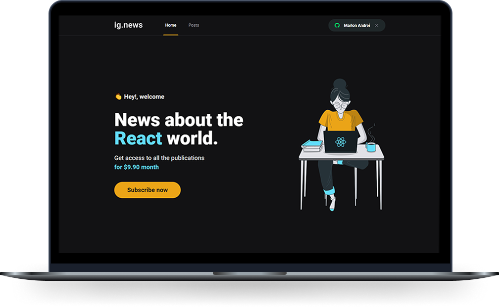

<h1 align="center">
   ignews
</h1

 

  

## 💻 Projeto

Aplicação de um blog pago onde o usuário loga com a sua conta  do GitHub e paga sua inscrição usando o Stripe. Usuários que não possuem a inscrição, só conseguem ver alguns parágrafos iniciais do post, orefecendo a inscrição logo abaixo.

## 🔥 Tecnologias

Foi desenvolvido com as tecnologias:

- ReactJs
- Next.js
- TypeScript
- NextAuth
- Prismic CMS
- Stripe
- FaunaDB  
  
